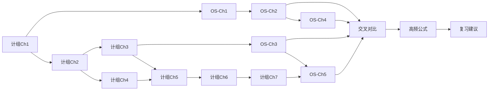

---
tags:
  - 408
  - 考研
  - MOC
  - 计组
  - 操作系统
aliases:
  - 408笔记首页
  - 408总览
cssclasses:
  - moc
---

# 🎓 408 考研复习笔记 —— MOC

> 📍 这是笔记的总入口。点击下方链接跳转到各章节，或使用 Obsidian 图谱视图查看知识网络。

---

## 📘 计算机组成原理（7章）

| 章节 | 文件 | 重点级别 |
|------|------|----------|
| Ch1 | [[计组-Ch1-计算机系统概述]] | ⭐⭐ |
| Ch2 | [[计组-Ch2-数据的表示和运算]] | ⭐⭐⭐ |
| Ch3 | [[计组-Ch3-存储系统]] | ⭐⭐⭐ |
| Ch4 | [[计组-Ch4-指令系统]] | ⭐⭐ |
| Ch5 | [[计组-Ch5-中央处理器]] | ⭐⭐⭐ |
| Ch6 | [[计组-Ch6-总线]] | ⭐ |
| Ch7 | [[计组-Ch7-输入输出系统]] | ⭐⭐ |

### 计组大纲速览

![[408-大纲-计组#计算机组成原理大纲]]

---

## 📗 操作系统（5章）

| 章节 | 文件 | 重点级别 |
|------|------|----------|
| Ch1 | [[OS-Ch1-操作系统概述]] | ⭐⭐ |
| Ch2 | [[OS-Ch2-进程管理]] | ⭐⭐⭐ |
| Ch3 | [[OS-Ch3-内存管理]] | ⭐⭐⭐ |
| Ch4 | [[OS-Ch4-文件管理]] | ⭐⭐ |
| Ch5 | [[OS-Ch5-IO管理]] | ⭐⭐ |

### 操作系统大纲速览

![[408-大纲-OS#操作系统大纲]]

---

## 🔗 跨科专题

| 专题 | 文件 | 说明 |
|------|------|------|
| 交叉对比 | [[交叉知识点对比]] | 两科关联点一站式对比 |
| 公式汇总 | [[高频公式汇总]] | 408 全部核心公式速查 |
| 复习建议 | [[复习建议]] | 重点章节 + 出题方向 |

---

## 🧭 推荐复习路径

> 💡 按图依次复习，关联章节一起看效果更佳。

---

## 📌 快捷入口

- 🔥 **大题重点**：[[计组-Ch3-存储系统]] · [[计组-Ch5-中央处理器]] · [[OS-Ch2-进程管理]] · [[OS-Ch3-内存管理]]
- ⚠️ **易混考点**：[[交叉知识点对比]]
- 📐 **公式速查**：[[高频公式汇总]]
