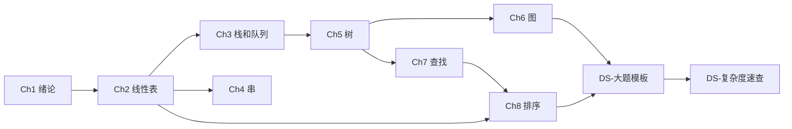

# 📊 408 数据结构 —— 以代码为镜

> 📍 总入口。每题从代码出发理解考点，底层跑通再回头做题。

---

## 章节导航

| 章节 | 笔记 | 代码文件 | 重点 |
|------|------|----------|------|
| Ch1 | [[DS-Ch1-绪论]] | — | ⭐⭐ |
| Ch2 | [[DS-Ch2-线性表]] | `SeqList.c` `LinkedList.c` | ⭐⭐⭐ |
| Ch3 | [[DS-Ch3-栈和队列]] | `Stack.c` `Queue.c` | ⭐⭐ |
| Ch4 | [[DS-Ch4-串]] | `KMP.c` | ⭐⭐ |
| Ch5 | [[DS-Ch5-树与二叉树]] | `BinaryTree.c` `BST.c` `AVL.c` `Heap.c` | ⭐⭐⭐ |
| Ch6 | [[DS-Ch6-图]] | `Graph.c` `Dijkstra.c` `TopoSort.c` | ⭐⭐ |
| Ch7 | [[DS-Ch7-查找]] | `BinarySearch.c` `HashTable.c` | ⭐⭐ |
| Ch8 | [[DS-Ch8-排序]] | `Sort.c`（含全部排序） | ⭐⭐⭐ |
| 收尾 | [[DS-大题模板]] · [[DS-复杂度速查]] | — | — |

---

## 🧭 推荐学习路径

---

## 💡 使用方式

1. **每章先看代码** — 跑通核心数据结构的基本操作
2. **回到笔记看考点** — 代码中用 `//==408考点==` 标注的注释重点读
3. **做课后大题** — 结合 `DS-大题模板` 练习手写算法

> 关联科目：[[../408-复习笔记/408-复习笔记-MOC|408 计组+OS 笔记]]
